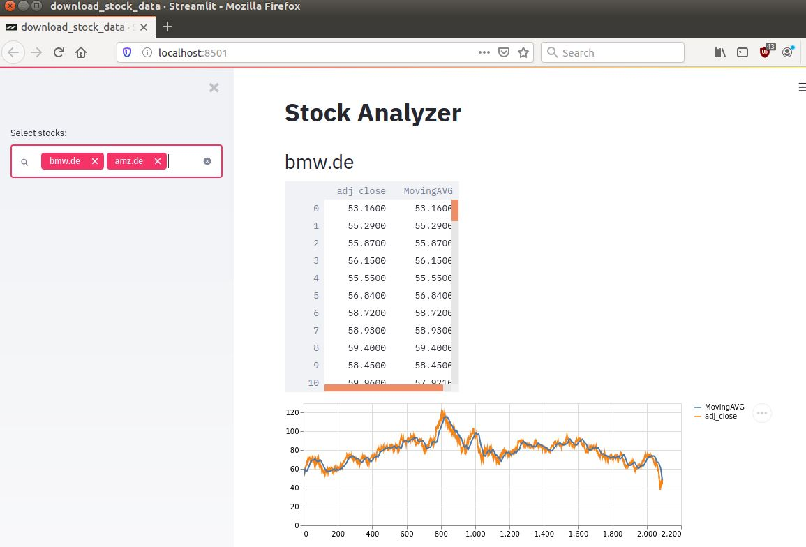

# Stock Price Data - Downloader and Deep Learning

This repository delivers all required parts for Deep Learning on Stock Data

## Stock data management
* Stock data downloader
* Stock data visualization with Streamlit
* Stock data handling on local `*.csv` files

## Prerequisites

### Create a virtual environment and install required packages
```bash
virtualenv venv
pip install -r requirements.txt
```

### Get your API-Key from Alphavantage
Go to [Alpha Vantage](https://www.alphavantage.co/) and create your API-KEY.

Set the API-Key as environment variable:
```bash
export API_KEY="YourAPIKey"
```

### Usage:
* `streamlit run download_stock_data.py`
* Select the stocks that should be downloaded and visualized
* There already is a huge list of stock symbols that can be easily extended

You should see the following page in your browser:



## Google Trends data
* Downloader for Google Trends
* Interactive Google Trends visualization with Streamlit
* Google Trends data handling on local `*.csv` files

### Usage:
* `streamlit run download_google_trends.py`
* Select the stocks for which the trend should be downloaded and visualized
* There already is a huge list of stock symbols that can be easily extended

## Deep Learning with fast.ai
With stock data and google trend data downloaded in the previous steps, 
you can now train a deep neural network for a specific stock.

### Usage:
* `streamlit run train_lstm_model.py`

Based on **Stock-Data** and **Google-Trend-Data** a neural network 
(customized `LSTM`) is trained to predict future stock prices.
